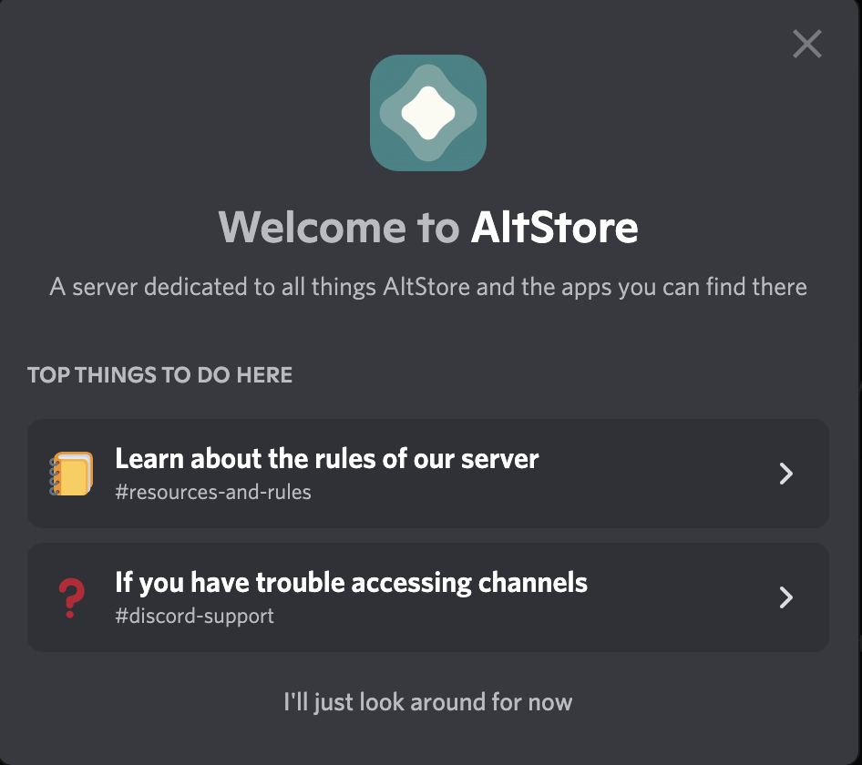

# 🛍 AltStore

### News

"News"タブは、主要なアプリの更新、今後実装の機能など、私たちからのすべてのニュースの更新を表示することができます。

.png>)

## Browse

"Browse"タブは、サイドロードが行えるアプリを探すことができます。

アプリをタップして、アプリの説明やスクリーンショットを含む詳細ページを表示したり、<mark style="background-color:red;">FREE</mark>のボタンをタップすることでインストールを行うこともできます。

 (1) (1).png>)

## My Apps

"My Apps"タブでは、AltStoreを利用してインストールしたAppを確認することができます。

 (1).png>)

AltStoreを使用してインストールしたAppは、7日後に署名の期限が切れてしまうため起動できなくなります。そのため、AltStoreは署名が切れる前にバックグラウンドで更新を行い、この問題が発生しないようにしていますが、"Refresh All"を押して、いつでも手動で更新を行うこともできます。

また、Appleの仕様により一度にインストール可能なサイドロードAppの数は3つに制限されています。これを回避するために、サイドロードしたAppを「非アクティブ化」することができます。この操作を行うと、データのバックアップを行ったうえで、デバイスからAppをアンインストールし、別のApp用のスロットを開けることができます。また、アプリを再度「アクティブ化」し、インストールを行なった上で、以前のデータを復元することも可能です。Appの「アクティブ化」と「非アクティブ化」については、アプリのアクティブ化ページを参照してください。

## Settings

"Settings"タブでは、AltStoreの設定を表示・変更できます。

#### ACCOUNT

名前や、メールアドレスなどのApple IDの情報、およびアカウントが「開発者アカウント(Developer Account)」か「一般のアカウント(Free Developer Account)」かを表示します。

#### Patreon

"Join the beta"をタップすることで、Patreonアカウントの連携画面が表示されます。Patreonに参加している場合は、アカウントを連携することで、"My Apps"タブから、AltStore、Delta、ClipのBata版のサイドロードが行えます。

#### Refreshing Apps

"Background Refresh"が有効になっている場合、AltStoreは定期的にバックグラウンドでAltServerを使用してAppの更新を試行します。また、"Add to Siri..."をタップすることで、SiriやショートカットApp（パーソナルオートメーションも含む）で直接実行できるSiriショートカットの作成が行います。
